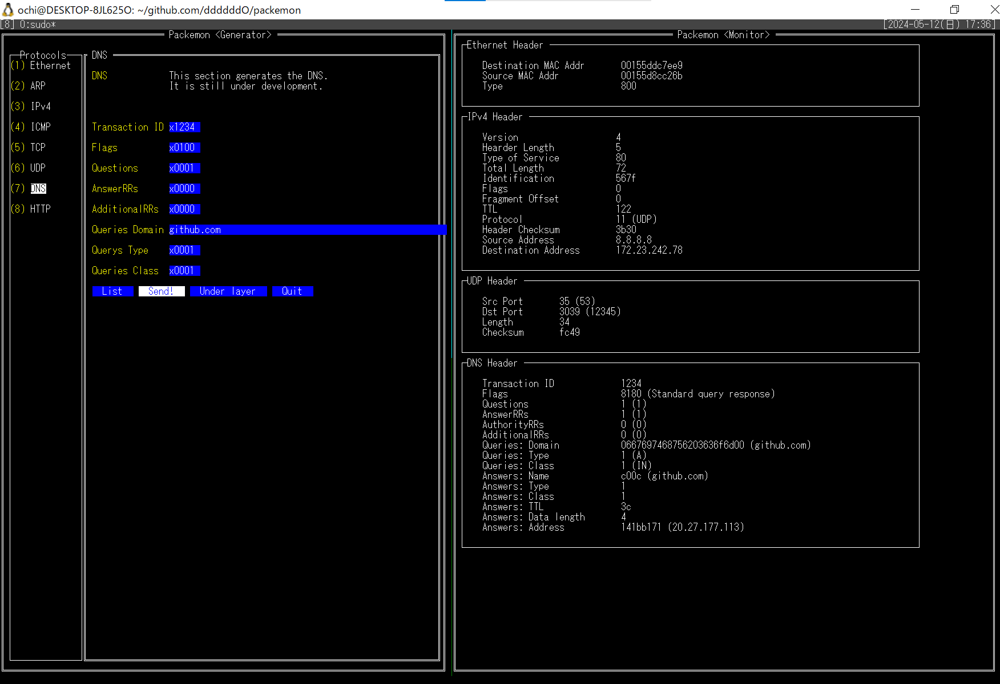
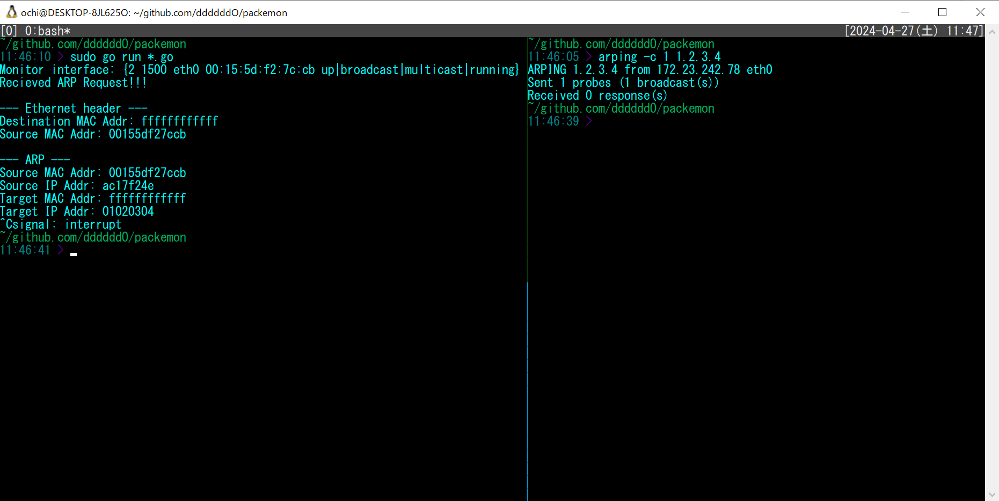
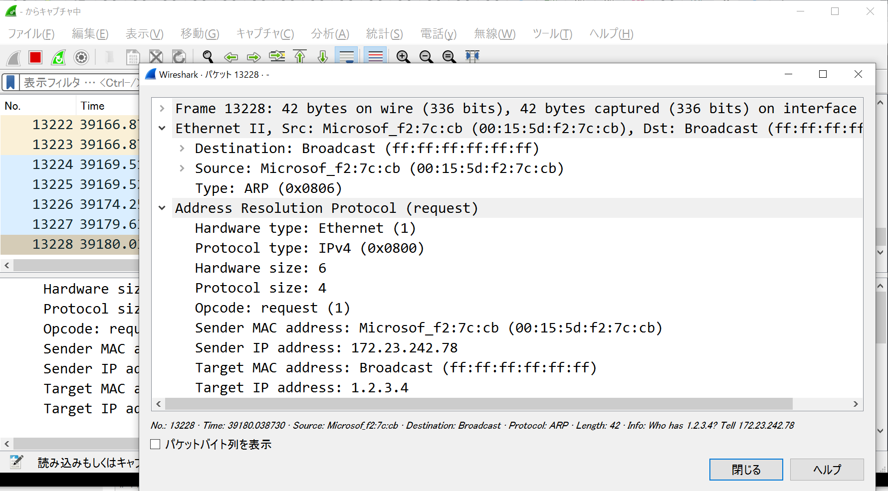

# Packémon

Packet monster, or `Packémon` for short! (っ‘-’)╮=͟͟͞͞◒ ヽ( '-'ヽ) <br>


TUI tool and Go library for sending packets of arbitrary input and monitoring packets on any network interfaces (default: `eth0`). **This tool is not available for Windows and macOS. I have confirmed that it works on Debian on WSL2.**<br>

I intend to develop it patiently🌴


## Feature

This TUI tool has two major functions: packet generation and packet monitoring.




This image shows packemon running in Generator / Monitor mode.</br>
DNS query packet generated by Generator on the left is shown in 27st line of the Monitor. DNS query response packet is shown as 28nd line, and a more detailed view of it is shown in the image below.

Packemon's Monitor allows user to select each packet by pressing `Enter` key. Then, select any line and press `Enter` key to see the details of the desired packet. Pressing `Esc` key in the packet detail screen will return you to the original packet list screen.

### Packet Generator

- [x] Send generated packets to any network interfaces.
  - You can specify network interface with `--interface` flag. Default is `eth0`.

- The following types of packets are covered.
  - [x] Ethernet
  - [x] ARP (WIP)
  - [x] IPv4 (WIP)
  - [x] ICMP (WIP)
  - [x] TCP (WIP)
  - [x] UDP (WIP)
  - [x] DNS (WIP)
  - [x] HTTP (WIP)
  - [ ] xxxxx....

### Packet Monitor

- [x] Monitor any network interfaces.
  - You can specify network interface with `--interface` flag. Default is `eth0`.

- The following types of packets are covered.
  - [x] Ethernet
  - [x] ARP
  - [x] IPv4 (WIP)
  - [x] ICMP (WIP)
  - [x] TCP (WIP)
  - [x] UDP
  - [ ] DNS (WIP)
    - [x] DNS query
    - [x] DNS query response
    - [ ] xxxxx....
  - [ ] HTTP (WIP)
    - [x] HTTP GET request
    - [x] HTTP GET response
    - [ ] xxxxx....
  - [ ] xxxxx....

## Installation

```console
go install github.com/ddddddO/packemon/cmd/packemon
```

## Usage

- Packet Generator
  ```console
  sudo packemon --send
  ```

- Packet Monitor
  ```console
  sudo packemon
  ```

## Related tools
- netcat
- [Nmap](https://nmap.org/)

## Acknowledgment
- [rivo/tview](https://github.com/rivo/tview)
  - Packemon is using this TUI library.

- [Golangで作るソフトウェアルータ](https://booth.pm/ja/items/5290391)
  - The way Go handles syscalls, packet checksum logic, etc. was helpful. This is a book in Japanese.


## Log (japanese)

<details><summary>xxx</summary>

## Links
- 「Golangで作るソフトウェアルータ」
  - その実装コード: https://github.com/sat0ken/go-curo
- https://terassyi.net/posts/2020/03/29/ethernet.html
- 動作確認用コマンドの参考
  - https://zenn.dev/takai404/articles/76d47e944d8e18
- [Scrapboxメモ書き](https://scrapbox.io/ddddddo/%E3%83%8D%E3%83%83%E3%83%88%E3%83%AF%E3%83%BC%E3%82%AF%E7%B3%BB%E8%AA%AD%E3%81%BF%E7%89%A9)

- WSL2のDebianで動作した。

- 任意の Ethernet ヘッダ / IPv4 ヘッダ / ARP / ICMP を楽に作れてフレームを送信できる
- 以下はtmuxで3分割した画面に各種ヘッダのフォーム画面を表示している。そして ICMP echo request を送信し、 echo reply が返ってきていることを Wireshark で確認した様子
  
  
  

- フレームを受信して詳細表示（ARPとIPv4）
  

  <details><summary>少し前のUI（`5062561` のコミット）</summary>

  
  

  </details>

- TUIライブラリとして https://github.com/rivo/tview を使わせてもらってる🙇

### 動作確認

#### Raspberry Piで簡易http server
```console
pi@raspberrypi:~ $ sudo go run main.go
```

#### パケットキャプチャ
```console
$ sudo tcpdump -U -i eth0 -w - | /mnt/c/Program\ Files/Wireshark/Wireshark.exe -k -i -
```

- 受信画面

  ```console
  $ sudo go run cmd/packemon/main.go
  ```


- 送信画面

  ```console
  $ sudo go run cmd/packemon/main.go --send
  ```

- 単発フレーム送信コマンド（e.g. ARP request）

  ```console
  $ sudo go run cmd/packemon/main.go --debug --send --proto arp
  ```

#### 手軽にブロードキャスト
```console
$ arping -c 1 1.2.3.4
ARPING 1.2.3.4 from 172.23.242.78 eth0
Sent 1 probes (1 broadcast(s))
Received 0 response(s)
```

#### tcpでdns
```console
$ nslookup -vc github.com
```

### 動作確認の様子

<details><summary>xxx</summary>

- Ethernetフレームのみ作って送信（`77c9149` でコミットしたファイルにて）

  

- ARPリクエストを作って送信（`390f266` でコミットしたファイルにて。中身はめちゃくちゃと思うけど）

  

- ARPリクエストを受信してパース（`b6a025a` でコミット）

  
  

</details>
